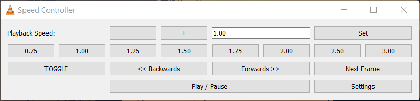
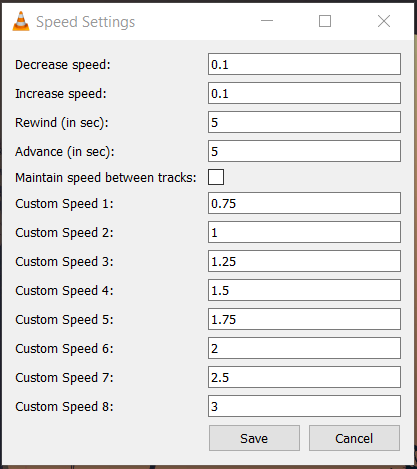

# VLC Speed Controller
Speed Controller Extension for VLC Media Player 3.0  
This extension allows you to quickly switch between 1.0x speed and a user configurable target speed, while also providing a GUI for playback control.  
Inspired by the functionality of the Google Chrome extension [Video Speed Controller](https://github.com/igrigorik/videospeed), as well as VLC extensions [Playback Speed Manager](https://github.com/ilgaiaz/playback-speed-manager) and [Jump to time Previous frame v3](https://addons.videolan.org/p/1154013/).  

## Features
- type in playback speed
- decrease playback speed
- increase playback speed
- toggle between 1.0x speed and previous playback speed
- set playback speed to user configurable preferred speed
- rewind / advance video by a set number of seconds
- jump to the next frame
- play / pause the video  

# Installation
Put the `vlc_speed_controller.lua` file in :  

- **Windows (all users)**
%ProgramFiles%\VideoLAN\VLC\lua\extensions\

- **Windows (current user)**
%APPDATA%\VLC\lua\extensions\

- **Linux (all users)**
/usr/lib/vlc/lua/extensions/

- **Linux (current user)**
~/.local/share/vlc/lua/extensions/

- **Mac OS X (all users)**
/Applications/VLC.app/Contents/MacOS/share/lua/extensions/

- **Mac OS X (current user)**
/Users/%your_name%/Library/ApplicationSupport/org.videolan.vlc/lua/extensions/

Restart VLC.  
Note: create the directories if they do not exist.

# How to use
- To open the Speed Controller window, go to:  
`View > VLC Speed Controller > Speed Controller`  
- To change the extension's settings, go to:  
`View > VLC Speed Controller > Settings`

# Interface
Below are some screenshots of the interface.

# Author
Andrei Hutu ([hutu.andrei@gmail.com](hutu.andrei@gmail.com))

# License
This extension is released under the [GNU General Public License (GPLv3)](https://www.gnu.org/licenses/gpl-3.0.html)  
